# VIS-05 — AI-Enabled Workflow Model

This document models the approved classroom simulation supplied by the Product Owner. All customers, cases, transactions, and role assignments are synthetic. This is not an official American Express application or a statement of American Express policy. The WP-04A source document is not present in this repository; no WP-04A requirement IDs are asserted here.

```mermaid
flowchart TD
    Start["Open synthetic case · simulated CSR role"] --> Verify{"Authorized human CSR attests<br/>simulation verification completed?"}
    Verify -->|No| Block["Block assessment and AI processing<br/>Record blocked action; case remains open"]
    Block --> Verify
    Verify -->|Yes| Assess["Record verification attestation<br/>CSR assessment is available"]
    Assess --> Mode{"CSR requests simulated AI assistance?"}
    Mode -->|No| Manual["CSR manual assessment / fallback"]
    Mode -->|Yes| AI["Deterministic simulated AI<br/>Summary, classification, uncertainty,<br/>and draft recommendation only"]
    AI --> Quality{"Output usable?"}
    Quality -->|Failed or unusable| Fallback["Record failure or unusable output<br/>Use manual fallback; preserve all gates"]
    Fallback --> Manual
    Quality -->|Usable and uncertain| Warning["Display output labeled Simulated AI<br/>Warning: uncertain output requires human review"]
    Quality -->|Usable| Output["Display output labeled Simulated AI<br/>Recommendation only"]
    Warning --> Review["CSR reviews evidence and recommendation"]
    Output --> Review
    Manual --> Review
    Review --> Request["Fictional $500 reversal request<br/>Requires simulated Supervisor approval"]
    Request --> Auth{"Supervisor authorization present?"}
    Auth -->|No| Missing["Supervisor assistance is needed for this action. No approval or account change has been performed."]
    Missing --> Open["Case remains open for review"]
    Open --> Supervisor["Simulated Supervisor reviews request<br/>Escalation itself grants no approval"]
    Supervisor --> Decision{"Human Supervisor decision"}
    Decision -->|Approved| Approved["Record Supervisor approval<br/>No reversal executed"]
    Decision -->|Rejected| Hold["Record rejection; case remains open for review"]
    Auth -->|Yes| Approved
    Request -->|CSR withdraws request| Withdrawn["Record withdrawal; case remains open for review"]
    Approved --> Trigger{"CSR explicitly triggers mock reversal?"}
    Trigger -->|No| Pending["Keep case open; no account change"]
    Trigger -->|Yes| Gate{"Verification, CSR role, and<br/>Supervisor approval still valid?"}
    Gate -->|No| BlockAction["Block mock action; record reason<br/>Missing authorization uses exact message above"]
    BlockAction --> Open
    Gate -->|Yes| Mock["Execute separate simulated reversal only"]
    Mock --> Result{"Mock action succeeds?"}
    Result -->|No| Failed["Record failed action; case remains open for review"]
    Result -->|Yes| Closure{"Authorized human CSR explicitly<br/>confirms simulated closure?"}
    Closure -->|No| Pending
    Closure -->|Yes| Closed["Record human closure decision<br/>Case transitions to simulated closed"]
    Audit["JSON audit export available throughout:<br/>synthetic case ID, attestation, blocked actions,<br/>AI output and uncertainty, human decisions,<br/>mock action results and case transitions<br/>Never include verification secrets"]
```

The audit box describes a cross-cutting control covering all branches, including blocked and failed attempts. Exporting audit data does not change case state. Rejected, withdrawn, and failed-action outcomes stay open for review and do not reach closure through this flow. Any further disposition requires an approved workflow decision.

Usable but uncertain AI output remains visible with a warning and human review. Failed or unusable AI output uses manual fallback. Neither route grants authority, bypasses verification, or substitutes for Supervisor approval, the separate CSR action, or explicit CSR closure.
