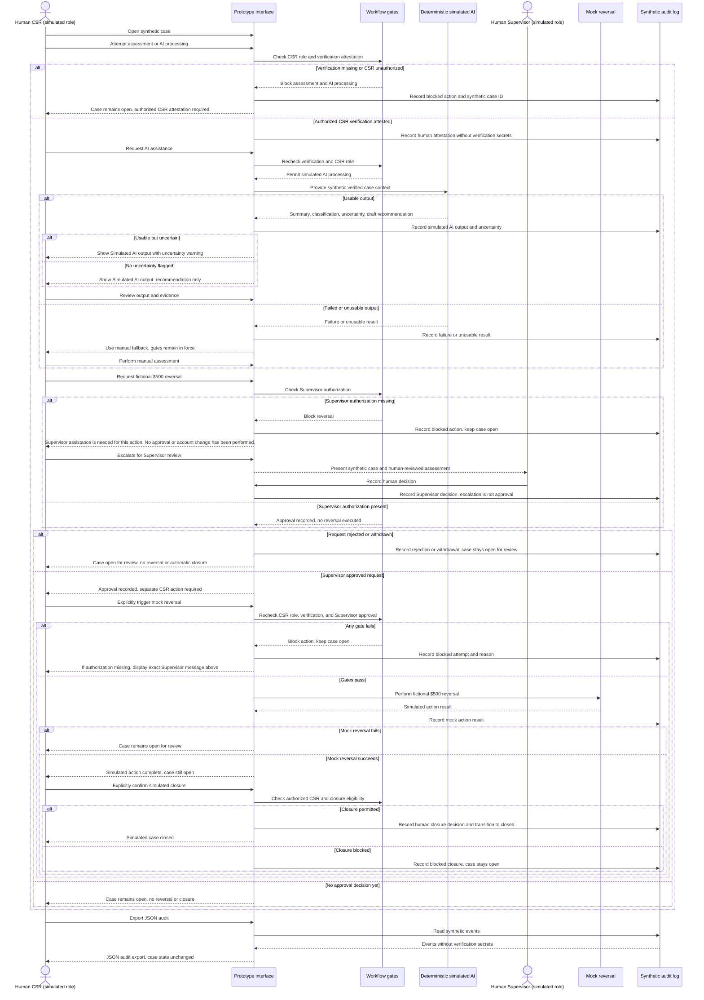

# VIS-06 — AI Interaction Sequence

All interactions below are classroom simulations with synthetic data and simulated CSR/Supervisor roles. AI is deterministic and labeled **Simulated AI**. These classroom controls are not actual American Express policies. No WP-04A requirement IDs are assigned.

The sequence shows one successful attestation path and its failure branches. An authorized human CSR supplies the verification attestation; AI never performs verification. Every assessment or AI entry point must enforce that prerequisite. The manual assessment route is also available without invoking AI, after verification.

Supervisor approval, CSR-triggered mock reversal, and CSR-confirmed closure are separate events. The absence of a CSR action or closure confirmation leaves the case open. Rejected, withdrawn, and failed-action cases remain open for review. No real banking or payment system is contacted.
