# VIS-06 — AI Interaction Sequence

All interactions below are classroom simulations with synthetic data and simulated CSR/Supervisor roles. AI is deterministic and labeled **Simulated AI**. These classroom controls are not actual American Express policies. No WP-04A requirement IDs are assigned.

```mermaid
sequenceDiagram
    actor CSR as Human CSR (simulated role)
    participant UI as Prototype interface
    participant Gate as Workflow gates
    participant AI as Deterministic simulated AI
    actor Supervisor as Human Supervisor (simulated role)
    participant Mock as Mock reversal
    participant Audit as Synthetic audit log

    CSR->>UI: Open synthetic case
    CSR->>UI: Attempt assessment or AI processing
    UI->>Gate: Check CSR role and verification attestation
    alt Verification missing or CSR unauthorized
        Gate-->>UI: Block assessment and AI processing
        UI->>Audit: Record blocked action and synthetic case ID
        UI-->>CSR: Case remains open. authorized CSR attestation required
    else Authorized CSR verification attested
        UI->>Audit: Record human attestation without verification secrets
        CSR->>UI: Request AI assistance
        UI->>Gate: Recheck verification and CSR role
        Gate-->>UI: Permit simulated AI processing
        UI->>AI: Provide synthetic verified case context
        alt Usable output
            AI-->>UI: Summary, classification, uncertainty, draft recommendation
            UI->>Audit: Record simulated AI output and uncertainty
            alt Usable but uncertain
                UI-->>CSR: Show Simulated AI output with uncertainty warning
            else No uncertainty flagged
                UI-->>CSR: Show Simulated AI output. recommendation only
            end
            CSR->>UI: Review output and evidence
        else Failed, unusable or unavailable output
            AI-->>UI: Failure, unusable result or unavailability
            UI->>Audit: Record failure, unusable result or unavailability
            UI-->>CSR: Show Complete Assessment Without AI. gates remain in force
            CSR->>UI: Perform manual assessment
        end

        UI->>Gate: Evaluate versioned routing rules from current case attributes
        alt Routine information request within CSR authority
            UI-->>CSR: Supervisor Approval Not Required.  routine completion available
            CSR->>UI: Explicitly confirm Complete Request after reviewed assessment
            UI->>Gate: Check verification, evidence, CSR role, assessment, current route
            UI->>Audit: Record CSR completion and routing metadata.  case stays open
            CSR->>UI: Separately confirm Case Closure
            UI->>Gate: Recheck current completion, route, verification and CSR role
            UI->>Audit: Record successful-resolution closure.  no financial action
        else Exception or unsupported request
            UI-->>CSR: Human review required.  no processing path authorized
            CSR->>UI: Request review after verification and human assessment
            UI->>Audit: Record review request and routing reason.  no approval granted
        else Exact $500 reversal requires Supervisor approval
        CSR->>UI: Request fictional $500 reversal
        UI->>Gate: Check Supervisor authorization
        alt Supervisor authorization missing
            Gate-->>UI: Block reversal
            UI->>Audit: Record blocked action. keep case open
            UI-->>CSR: Supervisor assistance is needed for this action. No approval or account change has been performed.
            CSR->>UI: Escalate for Supervisor review
            UI-->>Supervisor: Present synthetic case and human-reviewed assessment
            Supervisor->>UI: Record human decision
            UI->>Audit: Record Supervisor decision. escalation is not approval
        else Supervisor authorization present
            Gate-->>UI: Approval recorded. no reversal executed
        end

        alt Request rejected
            UI->>Audit: Record rejection. case stays open for review
            UI-->>CSR: Case open for review. no reversal or automatic closure
        else Supervisor approved request
            UI-->>CSR: Approval recorded. separate CSR action required
            CSR->>UI: Explicitly trigger mock reversal
            UI->>Gate: Recheck CSR role, verification, and Supervisor approval
            alt Any gate fails
                Gate-->>UI: Block action. keep case open
                UI->>Audit: Record blocked attempt and reason
                UI-->>CSR: If authorization missing, display exact Supervisor message above
            else Gates pass
                UI->>Mock: Perform fictional $500 reversal
                Mock-->>UI: Simulated action result
                UI->>Audit: Record mock action result
                alt Mock reversal fails
                    UI-->>CSR: Case remains open for review
                else Mock reversal succeeds
                    UI-->>CSR: Simulated action complete. case still open
                    CSR->>UI: Explicitly confirm simulated closure
                    UI->>Gate: Check authorized CSR and closure eligibility
                    alt Closure permitted
                        UI->>Audit: Record human closure decision and transition to closed
                        UI-->>CSR: Simulated case closed
                    else Closure blocked
                        UI->>Audit: Record blocked closure. case stays open
                    end
                end
            end
        else No approval decision yet
            UI-->>CSR: Case remains open. no reversal or closure
        end
        end
    end
    opt CSR requests cancellation of an open case
        CSR->>UI: Close / Cancel Case with preset reason and explicit confirmation
        UI->>Gate: Check CSR role, current verification, evidence, no processed reversal
        alt Reversal already processed (success or failure)
            Gate-->>UI: Block cancellation.  no automatic undo
            UI->>Audit: Record blocked cancellation and corrective-review requirement
            UI-->>CSR: Supervisor review required to determine separate corrective action
        else Missing verification, evidence, reason, confirmation or authority
            Gate-->>UI: Block cancellation.  case state unchanged
            UI->>Audit: Record blocked action and reason
        else Cancellation eligible
            UI->>Audit: Record CSR decision, reason, timestamp, closure and transition
            UI-->>CSR: Closed — Cancelled.  prior approval revoked
            Note over UI,Gate: Block further AI, approval, reversal and duplicate closure
        end
    end
    CSR->>UI: Export JSON audit
    UI->>Audit: Read synthetic events
    Audit-->>UI: Events without verification secrets
    UI-->>CSR: JSON audit export. case state unchanged
```

The sequence shows one successful attestation path and its failure branches. An authorized human CSR supplies the verification attestation; AI never performs verification. Every assessment or AI entry point must enforce that prerequisite. Complete Assessment Without AI is available only after failed, unusable or unavailable AI output, with verification and human evidence review still required.

Supervisor approval, CSR-triggered mock reversal, and CSR-confirmed closure are separate events. The absence of a CSR action or closure confirmation leaves the case open. Rejected cases remain open unless explicitly cancelled before processing; failed-action cases remain open and cannot be cancelled. No real banking or payment system is contacted.

Routine resolution requires distinct CSR completion and closure decisions with all verification/evidence guards. Review-only exceptions cannot be converted to executable financial approval. New audit events and JSON exports include routing metadata; approvals and completions bind the matched rule/version and case revision.
